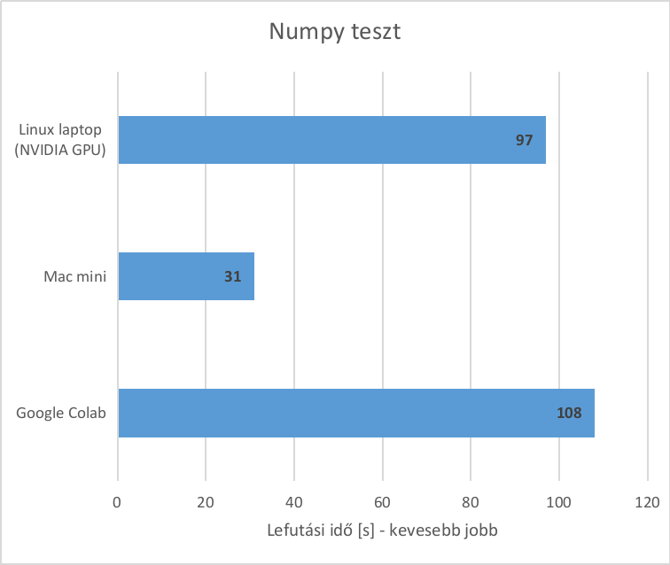
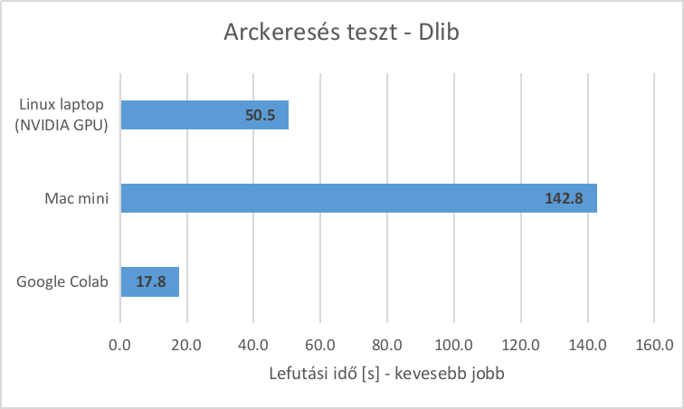

# Mac mini M1 teszt

Az új Apple Silicon M1 chip egyik újítása, hogy a chip tartalmaz egy Neural Engine nevű egységet, ami kifejezetten gépi tanulási feladatok gyorsítására készült ([souce](https://www.apple.com/mac/m1/)). 

Felmerült a kérdés, hogy az új architekúra hogyan teljesít a valóságban gépi tanulási feladtokon. Van-e olyan jó teljesítménye mint egy dedikált NVIDIA GPU-nak? Mik azok a keretrendszerek amik már támogatják az M1-es architektúrát, és mi az ami még nem?

Ebben a repo-ban olyan egyszerű teszt scriptek találhatóak amivel  fel lehet mérni egy gép teljesítményét gyakran (elsősorban gépi látás területén) előforduló ML feladatoknál. 

Tesztelt csomagok:

- Numpy: matematikai függvények, vektor és mátrix szorzás
- Tensorflow: gépi tanulási keretrendszer, ML modell tanítása
- Dlib: arcfelismeréshez kötődő feladatok
- Posenet: testtartás elemző modell futtatása

## Tesztelt hardverek
Három rendszer teljesítményét hasonlítottam össze: 

1. **Mac mini** (late 2020) macOS 11.2. Apple M1 chippel ellátva
2. **Linux laptop** (Ubuntu 20.10) (Intel i5-8265U, NVIDIA GeForce MX150)  
3. **Google Colab** ingyenes szolgáltatás (Ubuntu 18.04) (Intel Xeon, NVIDIA Tesla T4)

# Tesztek

A tesztek futtatásához szükséges első lépések platformonként eltérőek:

## Linux setup:

Első lépésként a CUDA Toolkit és cuDNN könyvtárak megfelelő verzióját kell telepíteni. Ezekre szükség lesz a TensowFlow telepítéséhez. Fontos, hogy megfelelő verzió legyen telepítve. Az [ITT](https://www.tensorflow.org/install/source#gpu) elérhető táblázatban megtalálható az aktuális kompatibilis verzió.

Installáláshoz a hivatalos guideok: [CUDA](https://developer.nvidia.com/cuda-toolkit-archive)-hoz és [cuDNN](https://docs.nvidia.com/deeplearning/cudnn/install-guide/index.html)-hez

A CUDA verziója ellenőrizhető a `nvcc -V` commanddal, a cuDNN verzióját pedig meg lehet nézni a `cudnn_version.h` fileban (.../cuda/include/cudnn_version.h).

Tesztelés során én a CUDA 11.1 és cuDNN 8.0.4-es verziót használtam.

**Dependenciák installálása**  
A requirements.txt fileban részletesen megtalálható, hogy melyik csomag melyik verzióját használtam.

Új virtuális környezet létrehozása után az alábbi csomagokat kell installálni: 
```
$ pip install tensorflow 
$ pip install dlib
$ pip install face_recognition
$ pip install torch
$ pip install opencv-python
```

Teszteljük le, hogy biztosan elérhető a GPU:
```
$ python3
>>> import tensorflow as tf
>>> tf.test_is_gpu_available()
True
>>> import dlib
>>> dlib.DLIB_USE_CUDA
True
```

## MacOS setup:

**TensorFlow** installálás:
A TensorFlow M1-es Mac-re optimalizált verziója itt érhető el: [LINK](https://github.com/apple/tensorflow_macos). A csomagot Conda environmenten keresztül lehet installálni, amihez van egy részletes leírás [itt](https://github.com/apple/tensorflow_macos/issues/153). Összefoglalva a lépéseket:  
* XCode command line toolok: `xcode-select --install`
* Miniforge telepítése
* új environment létrehozása `environment.yml` file alapján
* TensorFlow installálás:

```
$ pip install --upgrade --force --no-dependencies https://github.com/apple/tensorflow_macos/releases/download/v0.1alpha3/tensorflow_macos-0.1a3-cp38-cp38-macosx_11_0_arm64.whl https://github.com/apple/tensorflow_macos/releases/download/v0.1alpha3/tensorflow_addons_macos-0.1a3-cp38-cp38-macosx_11_0_arm64.whl
```

A további könyvtárak egyelőre nem támogatják az M1-es architektúrát. Condán és Pip-en keresztült lehet felrakni őket:

```
conda install cmake Pillow opencv
conda install pytorch -c isuruf/label/pytorch -c conda-forge
pip install dlib
pip install face_recognition
```

## Google Colab setup:

[Google Colab link](https://colab.research.google.com/)

Fontos, hogy session-nél állítsuk be a GPU használatát. Google Colabra a legtöbb csomag már telepítve van alapból, egyedül a face_recognition-t kell külön telepíteni:

```
!pip install face_recognition
```

## Tesztek leírása

A letöltött tesztek egyessével futtathatóak, például az alábbi módon:
```
$ python test_numpy.py
```

* A `test_numpy.py` a Numpy könvyvtár számítási teljesítményét méri. Lefuttatás után kiírja hány másodpercig tartott a script lefuttatása. 
* A `test_mnist.py` a TensorFlow keretrendszert használja, egy classifier betanítását végzi. Megfigyelhető egy tanítási ciklus (epoch) hány másodpercig tart.
* A `test_cifar10.py` Az előzőhöz hasonlóan TensorFlow keretrendszert használ, de itt a modell tanítása hosszabb ideig tart
* A `test_dlib.py` A dlib és face_recognition könyvtárak teljesítményét nézi. 400 képen fut le az arckereső és embedding kinyerő algoritmus.
* A `test_posenet_gpu.py` és `test_posenet_cpu.py` a testtartás elemző PoseNet Pytorch könyvtár furási idejét méri. A GPU verzió kihasználja a grafikus kártyát.

# Teszt eredmények

## Pozitívak

A Numpy teszt csak a CPU teljesítményét méri matematikai műveleteken. Ennél a tesztnél jó eredmény ért el az M1-es Mac mini.



A TensorFlow kiadott egy Mac M1-es architektúrára optimalizált verziót ([link](https://github.com/apple/tensorflow_macos)). A keretrendszer kissé bonyolultan telepíthető Miniconda segítségével, de miután sikerült felrakni rendkívűl egyszerű a használata. Egy felmerülő problémám volt nálam, hogy jelenleg csak a TensorFlow 2.4-es verziója támogatott, tehát régi 1.x projektek visszamenőleg nincsenek támogatva.

Az MNIST adathalmazra egy teljesen kapcsolt neurális hálót , míg a CIFAR10 adathalmazra egy konvolúciós neurális hálót tanítunk. A futtatási eredmények az alábbi ábrán láthatóak.


## Negatívak

Sajnos még csak néhány nagyobb könyvtár támogatja az M1-es ARM architektúrát. A nem támogatott csomagok a Rosetta 2 kompatibilitási rétegen keresztül futnak, amely lehetővé teszi az intel-alapú programok futtatását. Ez jelentősen ront a teljesítményen. A TensorFlow melletti másik nagy keretrendszer: a Pytorch még nem támogatja az M1-et.

Az arcfelismerés teszt abból áll, hogy 400 képen megkeressük a képen látható emberek arcát, és az alapján arclenyomat vektorokat generálunk. Bár az OpenCV támogatja az ARM architektúrát, a dlib csomag jelenleg csak Nvidia grafikus kártyát támogat, így az arckereső teszt lefuttatása jelentősen lassabb volt a Mac minin.



A testtartás elemző könyvtárak közül az [OpenPose](https://github.com/CMU-Perceptual-Computing-Lab/openpose) csak NVIDIA GPU-t támogat. A PoseNet könyvtárnál választhatunk Pytorch és [Tensorflow implementálás](https://github.com/rwightman/posenet-python) közül, így reméltem, hogy a Tensorflow verzióval jó eredmény érhető el, de mivel az implementáció a TensorFlow v1.12 verzióján készült, még nem támogatja az ARM architektúrát.

A pózdetektálás teszt bemeneti képeken futtatja le a testtartás elemző modellt. Az eredmény az 1 másodperc alatt feldolgozott képek (framek) számát adja.


# Összegzés

Jelenleg viszonylag kevés az olyan machine learning könyvtár ami támogatná az új Apple Silicon M1 chipet. Legjobb eredményeket TensorFlow keretrendszer használatával érhetünk el. Idővel várhatóan javulni fog a helyzet, de jelenleg hatékonyabb NVIDIA GPU vagy Cloud computing szolgáltatás használata.